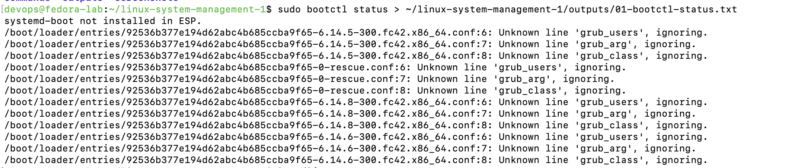
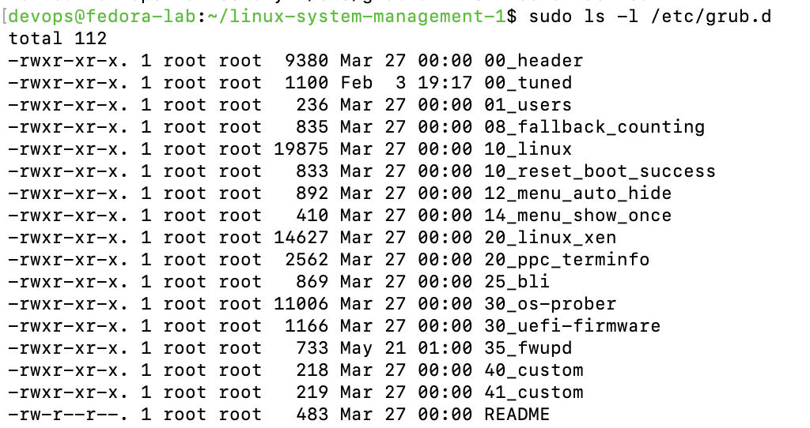
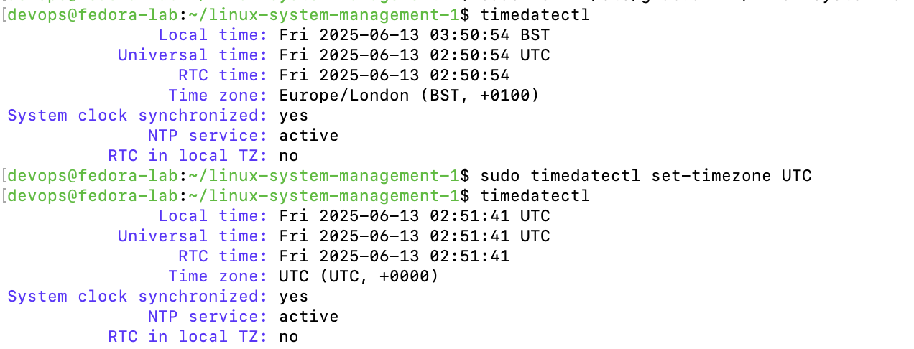

# 🧠 linux-system-management-1

> **Project 1 of 3** in the Linux System Management series  
> Focus: Boot Process, GRUB2, Timezone Configuration, Kernel Parameters

---

## 📌 Objectives

- Inspect and validate the system boot process
- Review GRUB2 configuration structure
- Set and verify system timezone
- List and filter kernel and network parameters using `sysctl`

---

## 🖥️ Environment

- Fedora Linux (remote system)
- SSH access from macOS terminal
- All commands executed remotely and documented with outputs and screenshots

---

## 📁 Project Structure

```
linux-system-management-1/
├── README.md
├── outputs/
│   ├── 01-bootctl-status.txt
│   ├── 02-grub-scripts.txt
│   ├── 03-timezone-status.txt
│   ├── 04-sysctl-kernel.txt
│   └── 05-sysctl-net.txt
└── screenshots/
    ├── 01-bootctl-status.png
    ├── 02-grub-directory-tree.png
    ├── 03-timezone-status.png
    ├── 04-sysctl-kernel-params.png
    └── 05-sysctl-network-params.png
```

---

## ⚙️ Command Execution & Results

### 1️⃣ View Boot Loader Status

```bash
bootctl status
```

📄 [`01-bootctl-status.txt`](outputs/01-bootctl-status.txt)  
📷 

---

### 2️⃣ List GRUB2 Scripts

```bash
ls -l /etc/grub.d
```

📄 [`02-grub-scripts.txt`](outputs/02-grub-scripts.txt)  
📷 

---

### 3️⃣ Check & Set Timezone

```bash
timedatectl
sudo timedatectl set-timezone UTC
timedatectl
```

📄 [`03-timezone-status.txt`](outputs/03-timezone-status.txt)  
📷 

---

### 4️⃣ Kernel Parameters (Filtered)

```bash
sysctl -a | grep kernel
```

📄 [`04-sysctl-kernel.txt`](outputs/04-sysctl-kernel.txt)  
📷 

---

### 5️⃣ Network Parameters (Optional)

```bash
sysctl -a | grep net
```

📄 [`05-sysctl-net.txt`](outputs/05-sysctl-net.txt)  
📷 

---

## ✅ Summary

This project demonstrates core Linux+ system management topics through real terminal output and command execution.  
Documentation and screenshots provide a full proof-of-execution trail, reinforcing both certification learning and DevOps practices.

---

## 🧠 Next Project

→ [linux-system-management-2](https://github.com/carlos-tech-ops/linux-system-management-2)  
Focus: Users, shadow file, `ulimit`, file operations
